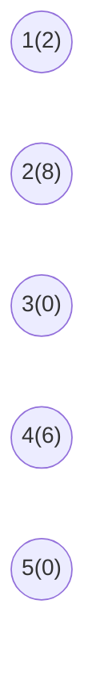
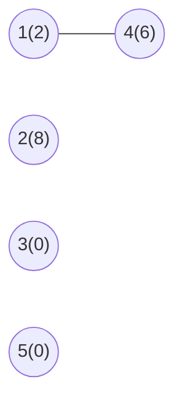
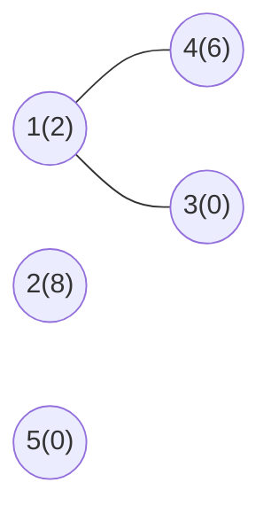
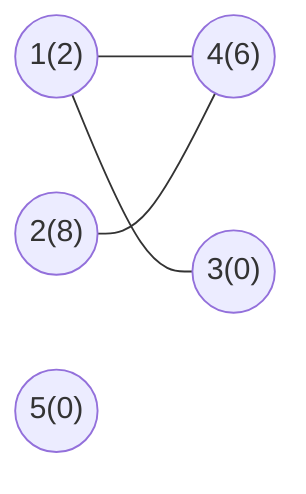
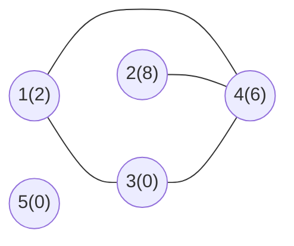
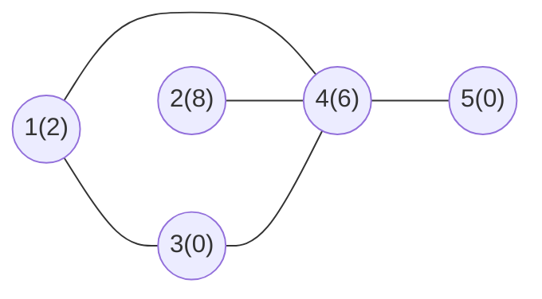
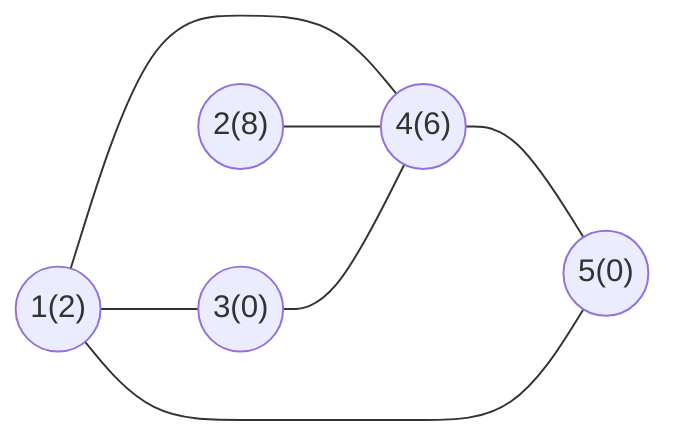

# Marco 2

## Construção do Grafo

### Compreensão de entrada

```txt
5
2 8 0 6 0
6
1 4
1 3
2 4
3 4
4 5
5 1
```

A primeira linha representa o **número de vértices** presentes no grafo, nesse caso, 5 vértices. Após ela existem 5 valores (referentes aos 5 vértices) que representam os custos associados a construção de um checkpoint em cada vértice, sendo esses os valores representados no grafo.

Então, na construção dos dados para a resolução do problema, os valores presentes na lista de adjacência representam um "identificador do vértice", enquanto os valores de custos serão armazenados em uma lista de mesmo tamanho da quantidade de vértices.

A terceira linha representa o número de arestas presentes, seguida por essa quantidade de linhas indicando as conexões entre os vértices.

### Construção Gradual da Representação do Grafo

Nessa seção, será realizada a construção simultânea da Representação Gráfica do Grafo, assim como a Lista de Adjacência associada.

#### Passo 1: Criação/Declaração dos vértices

Na entrada da instânica, nota-se 5 vértices, sendo caracterizados pelos valores de 1 até 5. Então, para a representação gráfica inicial temos:


Além disso, para a representação da Lista de Adjacência, como ainda não há nenhuma aresta presente, temos:

|Vértice|Vértices Adjacêntes|
|:-:|:-- |
|1||
|2||
|3||
|4||
|5||

#### Passo 2: Armazenamento dos valores de custo

No armazenamento dos valores de custo para a solução do problema será utilizada uma lista, mas para facilitar a compreensão do grafo os vértices terão entre parentêses o custo. Logo:

```py
custos = [2, 8, 0, 6, 0]
```



#### Passo 3: Ligação Vértice _1_ e _4_

Para a ligação entre vértices 1 e 4, assumindo um grafo não-direcionado, temos:

**Representação Gráfica:** Ligando os vértices 1 e 4.



**Lista de Adjacência:** Adicionando 4 na lista de vértices adjacêntes do 1 e o vértice 1 na lista do 4.

|Vértice|Vértices Adjacêntes|
|:-:|:--|
|1|4|
|2||
|3||
|4|1|
|5||

#### Passo 4: Ligação Vértice _1_ e _3_

Para a ligação entre vértices 1 e 3, assumindo um grafo não-direcionado, temos:

**Representação Gráfica:** Ligando os vértices 1 e 3.



**Lista de Adjacência:** Adicionando 3 na lista de vértices adjacêntes do 1 e o vértice 1 na lista do 3.

|Vértice|Vértices Adjacêntes|
|:-:|:--|
|1|4, 3|
|2||
|3|1|
|4|1|
|5||

#### Passo 5: Ligação Vértice _2_ e _4_

Para a ligação entre vértices 2 e 4, assumindo um grafo não-direcionado, temos:

**Representação Gráfica:** Ligando os vértices 2 e 4.



**Lista de Adjacência:** Adicionando 4 na lista de vértices adjacêntes do 2 e o vértice 2 na lista do 4.

|Vértice|Vértices Adjacêntes|
|:-:|:--|
|1|4, 3|
|2|4|
|3|1|
|4|1, 2|
|5||

#### Passo 6: Ligação Vértice _3_ e _4_

Para a ligação entre vértices 3 e 4, assumindo um grafo não-direcionado, temos:

**Representação Gráfica:** Ligando os vértices 3 e 4.



**Lista de Adjacência:** Adicionando 4 na lista de vértices adjacêntes do 3 e o vértice 3 na lista do 4.

|Vértice|Vértices Adjacêntes|
|:-:|:--|
|1|4, 3|
|2|4|
|3|1, 4|
|4|1, 2, 3|
|5||

#### Passo 7: Ligação Vértice _4_ e _5_

Para a ligação entre vértices 4 e 5, assumindo um grafo não-direcionado, temos:

**Representação Gráfica:** Ligando os vértices 4 e 5.



**Lista de Adjacência:** Adicionando 5 na lista de vértices adjacêntes do 4 e o vértice 4 na lista do 5.

|Vértice|Vértices Adjacêntes|
|:-:|:--|
|1|4, 3|
|2|4|
|3|1, 4|
|4|1, 2, 3, 5|
|5|4|

#### Passo 8: Ligação Vértice _5_ e _1_

Para a ligação entre vértices 5 e 1, assumindo um grafo não-direcionado, temos:

**Representação Gráfica:** Ligando os vértices 5 e 1.



**Lista de Adjacência:** Adicionando 1 na lista de vértices adjacêntes do 5 e o vértice 5 na lista do 1.

|Vértice|Vértices Adjacêntes|
|:-:|:--|
|1|4, 3, 5|
|2|4|
|3|1, 4|
|4|1, 2, 3, 5|
|5|4, 1|

### Grafo e Lista de Adjacência

Com isso, temos a representação final do **grafo** e da **lista de adjacência**:

**Grafo**:


**Lista de Adjacência**:

|Vértice|Vértices Adjacêntes|
|:-:|:--|
|1|4, 3, 5|
|2|4|
|3|1, 4|
|4|1, 2, 3, 5|
|5|4, 1|

# Referencia para Vitor e Renato

Essa parte é só para manter a estrutura do grafo caso vocês precisem para ilustar a parte de vocês. Se não houver necessidade favor remover antes do envio.

````mermaid
flowchart LR
    A((2))
    B((8))
    C((0))
    D((6))
    E((0))   


    A --- D
    A --- C
    B --- D
    C --- D
    D --- E
    A --- E

    classDef normal fill:#2d68ad,stroke:#2d68ad,stroke-width:1px, 
    classDef police fill:#dd0c19,stroke:#dd0c19, stroke-width: 1px

    class A,B police
    class C normal 

````

## DFS e Identificação das Componentes Conexas

> **Responsável: Vitor Dantas**

### Estruturas de Dados Utilizadas

<!-- Preencher com a explicação das estruturas usadas pelo algoritmo de componentes conexas, como:
- vetor de visitados;
- vetor de identificadores das componentes;
- contador de componentes;
- lista de adjacência.
-->

### Rastreamento da DFS Recursiva

<!-- Preencher com o rastreamento manual do algoritmo de componentes conexas,
mostrando a ordem de visita dos vértices e como cada vértice recebe o identificador
da componente correspondente.
-->

### Identificação das Componentes Conexas

<!-- Preencher com a explicação da lógica utilizada para identificar as componentes conexas. -->

### Complexidade de Tempo e Espaço

<!-- Preencher com a justificativa da complexidade de tempo e espaço do algoritmo. -->

### Custo das Consultas de Conectividade

<!-- Preencher com a justificativa do custo para verificar se dois vértices pertencem
à mesma componente conexa. -->

## Análise Matemática do Grafo

> **Responsável: Renato Romano**

Para esta análise, considera-se o grafo adaptado para **simples e não direcionado**, conforme exigido no Marco 2.

A partir da entrada escolhida, temos as seguintes arestas:

```text
1 - 4
1 - 3
2 - 4
3 - 4
4 - 5
5 - 1
```

O grafo é conexo, pois existe um caminho entre qualquer par de vértices. Dessa forma, há apenas uma componente conexa:

```text
C1 = {1, 2, 3, 4, 5}
```

### Distâncias entre os Vértices

A distância entre dois vértices corresponde ao comprimento do caminho mais curto entre eles.

As menores distâncias entre os vértices são:

| Vértice de origem | Distância até 1 | Distância até 2 | Distância até 3 | Distância até 4 | Distância até 5 |
|:-:|:-:|:-:|:-:|:-:|:-:|
| 1 | 0 | 2 | 1 | 1 | 1 |
| 2 | 2 | 0 | 2 | 1 | 2 |
| 3 | 1 | 2 | 0 | 1 | 2 |
| 4 | 1 | 1 | 1 | 0 | 1 |
| 5 | 1 | 2 | 2 | 1 | 0 |

### Excentricidades

A excentricidade de um vértice corresponde à maior, entre as menores distâncias desse vértice até os demais vértices da componente.

#### Vértice 1

As distâncias de 1 até os demais vértices são:

```text
d(1,2) = 2
d(1,3) = 1
d(1,4) = 1
d(1,5) = 1
```

Assim:

```text
exc(1) = max{2,1,1,1} = 2
```

#### Vértice 2

As distâncias de 2 até os demais vértices são:

```text
d(2,1) = 2
d(2,3) = 2
d(2,4) = 1
d(2,5) = 2
```

Assim:

```text
exc(2) = max{2,2,1,2} = 2
```

#### Vértice 3

As distâncias de 3 até os demais vértices são:

```text
d(3,1) = 1
d(3,2) = 2
d(3,4) = 1
d(3,5) = 2
```

Assim:

```text
exc(3) = max{1,2,1,2} = 2
```

#### Vértice 4

As distâncias de 4 até os demais vértices são:

```text
d(4,1) = 1
d(4,2) = 1
d(4,3) = 1
d(4,5) = 1
```

Assim:

```text
exc(4) = max{1,1,1,1} = 1
```

#### Vértice 5

As distâncias de 5 até os demais vértices são:

```text
d(5,1) = 1
d(5,2) = 2
d(5,3) = 2
d(5,4) = 1
```

Assim:

```text
exc(5) = max{1,2,2,1} = 2
```

Portanto, as excentricidades dos vértices são:

```text
exc(1) = 2
exc(2) = 2
exc(3) = 2
exc(4) = 1
exc(5) = 2
```

### Raio da Componente

O raio corresponde à menor excentricidade entre os vértices da componente.

```text
raio(C1) = min{2,2,2,1,2}
raio(C1) = 1
```

### Diâmetro da Componente

O diâmetro corresponde à maior excentricidade entre os vértices da componente.

```text
diâmetro(C1) = max{2,2,2,1,2}
diâmetro(C1) = 2
```

### Vértices Centrais

Um vértice é considerado central quando sua excentricidade é igual ao raio da componente.

Como:

```text
raio(C1) = 1
```

e apenas o vértice 4 possui excentricidade igual a 1:

```text
exc(4) = 1
```

o vértice central da componente é:

```text
4
```

### Centro da Componente

O centro de uma componente é o conjunto formado por todos os seus vértices centrais.

Logo:

```text
centro(C1) = {4}
```

### Resumo da Análise

| Propriedade | Resultado |
|---|---|
| Componente conexa | `{1,2,3,4,5}` |
| `exc(1)` | 2 |
| `exc(2)` | 2 |
| `exc(3)` | 2 |
| `exc(4)` | 1 |
| `exc(5)` | 2 |
| Raio | 1 |
| Diâmetro | 2 |
| Vértice central | 4 |
| Centro | `{4}` |
