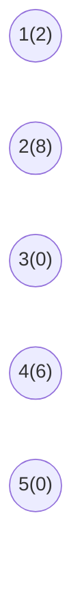
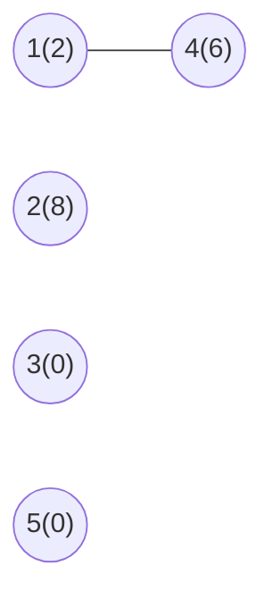
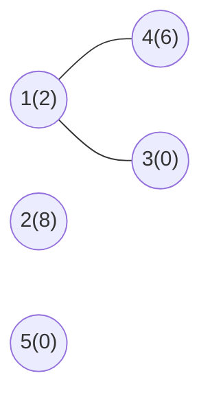
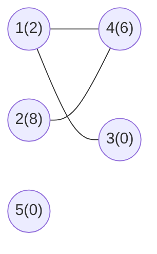
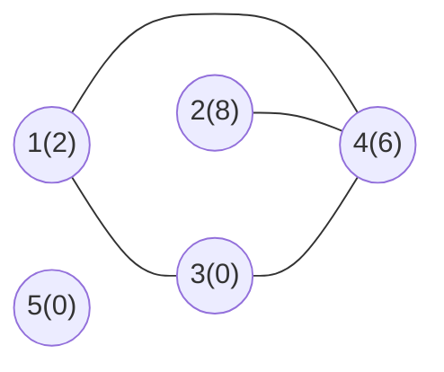
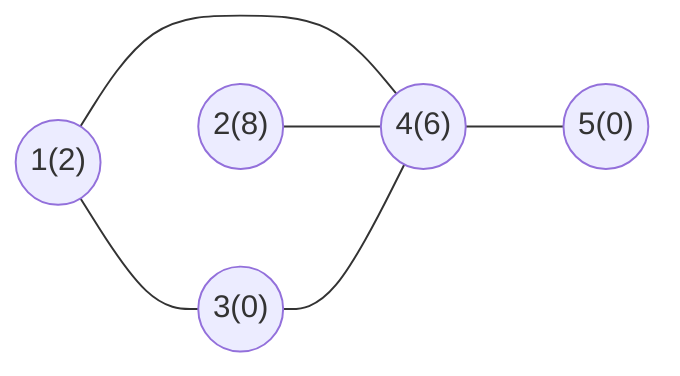
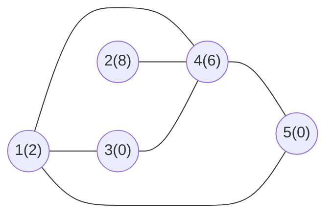

# Marco 2

## Construção do Grafo

### Compreensão de entrada

```txt
5
2 8 0 6 0
6
1 4
1 3
2 4
3 4
4 5
5 1
```

A primeira linha representa o **número de vértices** presentes no grafo, nesse caso, 5 vértices. Após ela existem 5 valores (referentes aos 5 vértices) que representam os custos associados a construção de um checkpoint em cada vértice, sendo esses os valores representados no grafo.

Então, na construção dos dados para a resolução do problema, os valores presentes na lista de adjacência representam um "identificador do vértice", enquanto os valores de custos serão armazenados em uma lista de mesmo tamanho da quantidade de vértices.

A terceira linha representa o número de arestas presentes, seguida por essa quantidade de linhas indicando as conexões entre os vértices.

### Construção Gradual da Representação do Grafo

Nessa seção, será realizada a construção simultânea da Representação Gráfica do Grafo, assim como a Lista de Adjacência associada.

#### Passo 1: Criação/Declaração dos vértices

Na entrada da instânica, nota-se 5 vértices, sendo caracterizados pelos valores de 1 até 5. Então, para a representação gráfica inicial temos:


Além disso, para a representação da Lista de Adjacência, como ainda não há nenhuma aresta presente, temos:

|Vértice|Vértices Adjacêntes|
|:-:|:-- |
|1||
|2||
|3||
|4||
|5||

#### Passo 2: Armazenamento dos valores de custo

No armazenamento dos valores de custo para a solução do problema será utilizada uma lista, mas para facilitar a compreensão do grafo os vértices terão entre parentêses o custo. Logo:

```py
custos = [2, 8, 0, 6, 0]
```



#### Passo 4: Ligação Vértice _1_ e _4_

Para a ligação entre vértices 1 e 4, assumindo um grafo não-direcionado, temos:

**Representação Gráfica:** Ligando os vértices 1 e 4.



**Lista de Adjacência:** Adicionando 4 na lista de vértices adjacêntes do 1 e o vértice 1 na lista do 4.

|Vértice|Vértices Adjacêntes|
|:-:|:--|
|1|4|
|2||
|3||
|4|1|
|5||

#### Passo 5: Ligação Vértice _1_ e _3_

Para a ligação entre vértices 1 e 3, assumindo um grafo não-direcionado, temos:

**Representação Gráfica:** Ligando os vértices 1 e 3.



**Lista de Adjacência:** Adicionando 3 na lista de vértices adjacêntes do 1 e o vértice 1 na lista do 3.

|Vértice|Vértices Adjacêntes|
|:-:|:--|
|1|4, 3|
|2||
|3|1|
|4|1|
|5||

#### Passo 6: Ligação Vértice _2_ e _4_

Para a ligação entre vértices 2 e 4, assumindo um grafo não-direcionado, temos:

**Representação Gráfica:** Ligando os vértices 2 e 4.



**Lista de Adjacência:** Adicionando 4 na lista de vértices adjacêntes do 2 e o vértice 2 na lista do 4.

|Vértice|Vértices Adjacêntes|
|:-:|:--|
|1|4, 3|
|2|4|
|3|1|
|4|1, 2|
|5||

#### Passo 7: Ligação Vértice _3_ e _4_

Para a ligação entre vértices 3 e 4, assumindo um grafo não-direcionado, temos:

**Representação Gráfica:** Ligando os vértices 3 e 4.



**Lista de Adjacência:** Adicionando 4 na lista de vértices adjacêntes do 3 e o vértice 3 na lista do 4.

|Vértice|Vértices Adjacêntes|
|:-:|:--|
|1|4, 3|
|2|4|
|3|1, 4|
|4|1, 2, 3|
|5||

#### Passo 8: Ligação Vértice _4_ e _5_

Para a ligação entre vértices 4 e 5, assumindo um grafo não-direcionado, temos:

**Representação Gráfica:** Ligando os vértices 4 e 5.



**Lista de Adjacência:** Adicionando 5 na lista de vértices adjacêntes do 4 e o vértice 4 na lista do 5.

|Vértice|Vértices Adjacêntes|
|:-:|:--|
|1|4, 3|
|2|4|
|3|1, 4|
|4|1, 2, 3, 5|
|5|4|

#### Passo 9: Ligação Vértice _5_ e _1_

Para a ligação entre vértices 5 e 1, assumindo um grafo não-direcionado, temos:

**Representação Gráfica:** Ligando os vértices 5 e 1.



**Lista de Adjacência:** Adicionando 1 na lista de vértices adjacêntes do 5 e o vértice 5 na lista do 1.

|Vértice|Vértices Adjacêntes|
|:-:|:--|
|1|4, 3, 5|
|2|4|
|3|1, 4|
|4|1, 2, 3, 5|
|5|4, 1|

### Grafo e Lista de Adjacência

Com isso, temos a representação final do **grafo** e da **lista de adjacência**:

**Grafo**:


**Lista de Adjacência**:

|Vértice|Vértices Adjacêntes|
|:-:|:--|
|1|4, 3, 5|
|2|4|
|3|1, 4|
|4|1, 2, 3, 5|
|5|4, 1|

# Referencia para Vitor e Renato

Essa parte é só para manter a estrutura do grafo caso vocês precisem para ilustar a parte de vocês. Se não houver necessidade favor remover antes do envio.

````mermaid
flowchart LR
    A((2))
    B((8))
    C((0))
    D((6))
    E((0))   


    A --- D
    A --- C
    B --- D
    C --- D
    D --- E
    A --- E

    classDef normal fill:#2d68ad,stroke:#2d68ad,stroke-width:1px, 
    classDef police fill:#dd0c19,stroke:#dd0c19, stroke-width: 1px

    class A,B police
    class C normal 

````
