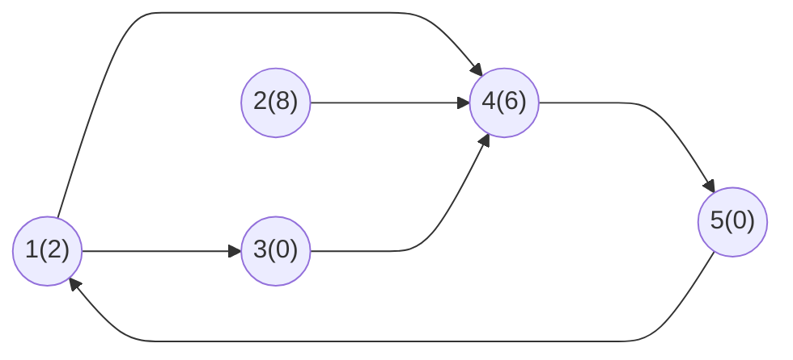
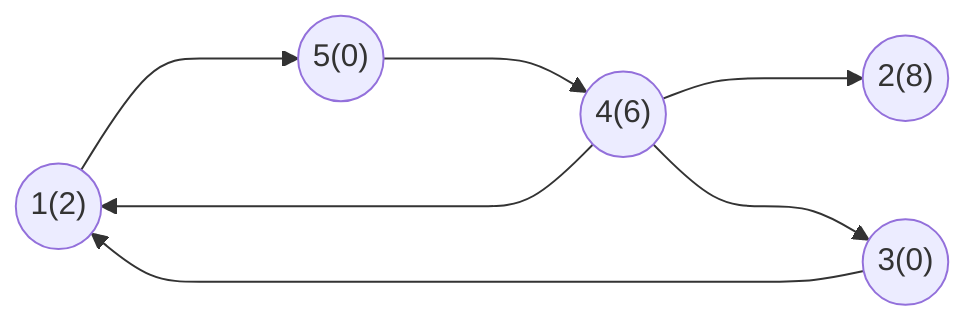

## Marco 3

## Propriedade e critério de reconhecimento

- **Propriedade**: Componentes fortemente conexas (CFCs)

- **Critério**: Um novo componente é identificado ao encontrar um vértice ainda não visitado; a DFS percorre todos os vértices alcançáveis e os associa ao mesmo componente.

Em cada componente identificado, é determinado o menor custo. Após isso, soma-se esses valores e multiplica pela quantidade de vértices que tem esse mínimo de gasto.

## Referências de algs4 e adaptações previstas

Para a estratégia do problema, serão utilizadas como referência algumas implementações disponíveis no `algs4-py`.

### `digraph.py`

A classe `Digraph` será utilizada como referência para representar o grafo direcionado do problema. Cada vértice representa um cruzamento da cidade e cada aresta representa uma rua de mão única.

A implementação já possui estruturas importantes para a estratégia, como a lista de adjacência, o método `add_edge(v, w)` para inserir arestas direcionadas e o método `reverse()`, responsável por gerar o grafo com todas as arestas invertidas.

A estrutura básica poderá ser reutilizada, sendo necessária principalmente a adaptação da leitura da entrada do problema, já que o formato utilizado pelo Codeforces é diferente do formato de entrada usado diretamente pelas implementações de referência.

### `depth_first_order.py`

A classe `DepthFirstOrder` será utilizada como referência para realizar buscas em profundidade e registrar a ordem de processamento dos vértices.

Para a estratégia escolhida, interessa principalmente a pós-ordem reversa obtida pelo método `reverse_post()`. Essa ordem é utilizada posteriormente pelo algoritmo de identificação das componentes fortemente conexas.

Não são previstas mudanças significativas no funcionamento da DFS. A implementação será usada principalmente como apoio para determinar a ordem em que os vértices deverão ser processados.

### `kosaraju_scc.py`

A classe `KosarajuSCC` será a principal referência algorítmica. Ela utiliza o algoritmo de Kosaraju para identificar as componentes fortemente conexas de um grafo direcionado.

A implementação mantém:

- `marked`, para registrar os vértices já visitados;
- `id`, para indicar a qual componente cada vértice pertence;
- `count`, para registrar a quantidade de componentes encontradas.

A identificação das componentes será mantida como base da solução. A principal adaptação será acrescentar o processamento dos custos dos vértices exigido pelo problema.

Depois que cada vértice possuir o identificador de sua componente, será necessário:

1. identificar o menor custo entre os vértices de cada componente;
2. contar quantos vértices daquela componente possuem esse menor custo;
3. somar os menores custos encontrados em todas as componentes;
4. multiplicar as quantidades de escolhas possíveis em cada componente;
5. aplicar o módulo `10^9 + 7` à quantidade final de maneiras.

Assim, o algoritmo de Kosaraju será responsável pela parte estrutural da solução, enquanto a adaptação acrescentará o tratamento dos custos necessário para produzir as duas informações exigidas na saída do problema.

## Rastreamento manual em uma instância pequena

### Instância

Para o rastreamento manual, usaremos inicialmente o grafo construido pela instância:

```txt
5
2 8 0 6 0
6
1 4
1 3
2 4
3 4
4 5
5 1
```

que, pela construção do marco anterior, mas com as direções das arestas, resultando em:

**Grafo**:



**Lista de Adjacência**:

|Vértice|Vértices Adjacêntes|
|:-:|:--|
|1|4, 3|
|2|4|
|3|4|
|4|5|
|5|1|

### Execução do Primeiro DFS

| Chamada | Ação | Marcados | Finalizados |
| --------------- | --------------- | --------------- | --------------- |
| DFS(1) | Marca 1 como visitado, avança para o 4 | {1} | {} |
| -> DFS(4) | Marca 4 como visitado, avança para 5 | {1, 4} | {} |
| -> -> DFS(5) | Marca 5 como visitado, não tem vizinhos não visitados, termina | {1, 4, 5} | {5} |
| -> Volta para 4 | não tem mais vizinhos não visitados, termina | {1, 4, 5} | {5, 4} |
| Volta para 1 | avança para o vizinho 3 | {1, 4, 5} | {5, 4} |
| -> DFS(3) | Marca 3 como visitado, não tem vizinhos não visitados, termina  | {1, 4, 5, 3} | {5, 4, 3} |
| Volta para 1 | Não tem vizinhos não visitados, termina | {1, 4, 5, 3} | {5, 4, 3, 1} |
| DFS(2) | Marca 2 como visitado, não tem vizinhos não visitados, termina | {1, 4, 5, 3, 2} | {5, 4, 3, 1, 2} |

### Resultados do Primeiro DFS

Para executar a ordem do DFS seguinte, será utilizada o inverso da ordem de finalizados, logo:

```
{2, 1, 3, 4, 5}
```

### Invertendo a direção das arestas

**Grafo**:



**Lista de Adjacência**:

|Vértice|Vértices Adjacêntes|
|:-:|:--|
|1|5|
|2||
|3|1|
|4|1, 2, 3|
|5|4|

### Segundo DFS

| Chamada | Ação | Visitados | CFC |
| --------------- | --------------- | --------------- | --------------- |
| POP -> 2 | Aplicar DFS no vértice 2 | {} | {} |
| DFS(2) | Marca 2 como visitado, como não possui mais vizinhos não visitados, termina adicionando percorridos ao  CFC | {2} | {{2}} |
| POP -> 1 | Aplicar DFS no vértice 1 | {2} | {{2}} |
| DFS(1) | Marca 1 como visitado, avança para o 5 | {2, 1} | {{2}} |
| -> DFS(5) | Marca 5 como visitado, avança para o 4  | {2, 1, 5} | {{2}} |
| -> -> DFS(4) | Marca 4 como visitado, 1 e 2 já foram visitados, avança para o 3 | {2, 1, 5, 4} | {{2}} |
| -> -> -> DFS(3) | Marca 3 como visitado, todos os vizinhos já estão visitados, voltando | {2, 1, 5, 4, 3 } | {{2}} |
| 4 | Todos os vizinhos já estão visitados, voltando para 5 | {2, 1, 5, 4, 3} | {{2}} |
| 5 | Todos os visinhos já estão visitados, voltando para 1 | {2, 1, 5, 4, 3} | {{2}} |
| 1 | Todos os visinhos já estão visitados, terminando e formando CFC | {2, 1, 5, 4, 3} | {{2}, {1, 5, 4, 3}} |

Com base nos valores de CFC encontrados, pode ser percorrida cada componente encontrado para se determinar o custo mínimo e a quantidade de possibilidades que existem.

## Estimativa de complexidade

Sejam `V` o número de vértices e `E` o número de arestas.

- **Tempo: `O(V + E)`.**

- **Memória total: `O(V + E)`.**

Esta é uma análise da estratégia. A adaptação efetiva das referências e a validação por execução serão registradas no marco 4.
