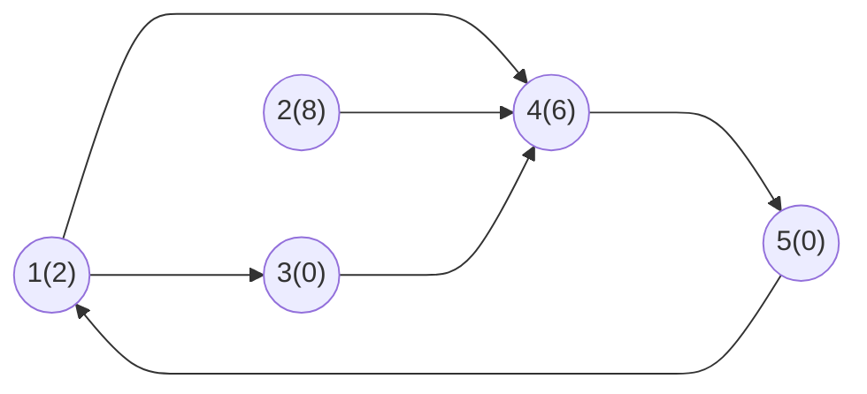
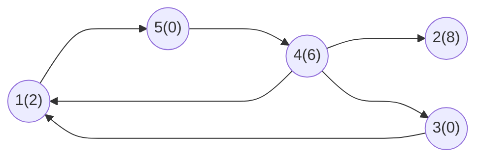

## Marco 3

## Propriedade e critério de reconhecimento

- **Propriedade**: Componentes fortemente conexas (CFCs)

- **Critério**: Um novo componente é identificado ao encontrar um vértice ainda não visitado; a DFS percorre todos os vértices alcançáveis e os associa ao mesmo componente.

Em cada componente identificado, é determinado o menor custo. Após isso, soma-se esses valores e multiplica pela quantidade de vértices que tem esse mínimo de gasto.

## Referências de algs4 e adaptações previstas

Para a estratégia do problema, serão utilizadas como referência algumas implementações disponíveis no `algs4-py`.

### `digraph.py`

A classe `Digraph` será utilizada como referência para representar o grafo direcionado do problema. Cada vértice representa um cruzamento da cidade e cada aresta representa uma rua de mão única.

A implementação já possui estruturas importantes para a estratégia, como a lista de adjacência, o método `add_edge(v, w)` para inserir arestas direcionadas e o método `reverse()`, responsável por gerar o grafo com todas as arestas invertidas.

A estrutura básica poderá ser reutilizada, sendo necessária principalmente a adaptação da leitura da entrada do problema, já que o formato utilizado pelo Codeforces é diferente do formato de entrada usado diretamente pelas implementações de referência.

### `depth_first_order.py`

A classe `DepthFirstOrder` será utilizada como referência para realizar buscas em profundidade e registrar a ordem de processamento dos vértices.

Para a estratégia escolhida, interessa principalmente a pós-ordem reversa obtida pelo método `reverse_post()`. Essa ordem é utilizada posteriormente pelo algoritmo de identificação das componentes fortemente conexas.

Não são previstas mudanças significativas no funcionamento da DFS. A implementação será usada principalmente como apoio para determinar a ordem em que os vértices deverão ser processados.

### `kosaraju_scc.py`

A classe `KosarajuSCC` será a principal referência algorítmica. Ela utiliza o algoritmo de Kosaraju para identificar as componentes fortemente conexas de um grafo direcionado.

A implementação mantém:

- `marked`, para registrar os vértices já visitados;
- `id`, para indicar a qual componente cada vértice pertence;
- `count`, para registrar a quantidade de componentes encontradas.

A identificação das componentes será mantida como base da solução. A principal adaptação será acrescentar o processamento dos custos dos vértices exigido pelo problema.

Depois que cada vértice possuir o identificador de sua componente, será necessário:

1. identificar o menor custo entre os vértices de cada componente;
2. contar quantos vértices daquela componente possuem esse menor custo;
3. somar os menores custos encontrados em todas as componentes;
4. multiplicar as quantidades de escolhas possíveis em cada componente;
5. aplicar o módulo `10^9 + 7` à quantidade final de maneiras.

Assim, o algoritmo de Kosaraju será responsável pela parte estrutural da solução, enquanto a adaptação acrescentará o tratamento dos custos necessário para produzir as duas informações exigidas na saída do problema.

## Rastreamento manual em uma instância pequena

### Instância

Para o rastreamento manual, usaremos inicialmente o grafo construído pela instância:

```txt
5
2 8 0 6 0
6
1 4
1 3
2 4
3 4
4 5
5 1
```

que, pela construção do marco anterior, mas com as direções das arestas, resulta em:

**Grafo**:



**Lista de Adjacência:**

| Vértice | Vértices Adjacêntes |
| :-: | :-- |
| 1 | 4, 3 |
| 2 | 4 |
| 3 | 4 |
| 4 | 5 |
| 5 | 1 |

Seguindo a implementação de referência ``kosaraju_scc.py`` do ``algs4-py``, o primeiro DFS é executado sobre o grafo invertido ($G^R$), e não sobre o grafo original. Portanto, antes de iniciar o rastreamento, invertemos as arestas.

### Invertendo a direção das arestas

**Grafo invertido:**



**Lista de Adjacência ($G^R$):**

|Vértice | Vértices Adjacêntes |
| :-: | :-- |
|1 | 5 |
|2 | |
|3 | 1 |
|4 | 1, 2, 3 |
|5 | 4 |

### Execução do Primeiro DFS (sobre G^R)

| Chamada | Ação | Marcados | Finalizados |
| --- | --- | --- | --- |
| DFS(1) | Marca 1 como visitado, avança para o 5 | {1} | {} |
| -> DFS(5) | Marca 5 como visitado, avança para o 4 | {1, 5} | {} |
| -> -> DFS(4) | Marca 4 como visitado; 1 já visitado, avança para o 2 | {1, 5, 4} | {} |
| -> -> -> DFS(2) | Marca 2 como visitado, não tem vizinhos, termina | {1, 5, 4, 2} | {2} |
| Volta para 4 | avança para o vizinho 3 | {1, 5, 4, 2} | {2} |
| -> -> -> DFS(3) | Marca 3 como visitado; 1 já visitado, não tem mais vizinhos, termina | {1, 5, 4, 2, 3} | {2, 3} |
| Volta para 4 | não tem mais vizinhos não visitados, termina | {1, 5, 4, 2, 3} | {2, 3, 4} |
| Volta para 5 | não tem mais vizinhos não visitados, termina | {1, 5, 4, 2, 3} | {2, 3, 4, 5} |
| Volta para 1 | não tem mais vizinhos não visitados, termina | {1, 5, 4, 2, 3} | {2, 3, 4, 5, 1} |

Como todos os vértices já estão marcados ao final de DFS(1), o laço externo não precisa iniciar novas chamadas para os vértices 2, 3, 4 e 5.

### Resultados do Primeiro DFS

A ordem de processamento do segundo DFS é dada pela pós-ordem reversa (reverse_post()) obtida acima. Invertendo a ordem de finalizados {2, 3, 4, 5, 1}, obtemos:

``{1, 5, 4, 3, 2}``

### Segundo DFS (sobre o grafo original G)

Com a ordem definida, o segundo DFS é executado sobre o grafo original (não invertido), seguindo exatamente o comportamento de kosaraju_scc.py.

| Chamada | Ação | Visitados | CFC |
| --- | --- | --- | --- |
| POP -> 1 | Aplicar DFS no vértice 1 | {} | {} |
| DFS(1) | Marca 1 como visitado, avança para o 4 | {1} | {} |
| -> DFS(4) | Marca 4 como visitado, avança para o 5 | {1, 4} | {} |
| -> -> DFS(5) | Marca 5 como visitado; 1 já visitado, não tem mais vizinhos, termina | {1, 4, 5} | {} |
| Volta para 4 | não tem mais vizinhos não visitados, termina | {1, 4, 5} | {} |
| Volta para 1 | avança para o vizinho 3 | {1, 4, 5} | {} |
| -> DFS(3) | Marca 3 como visitado; 4 já visitado, não tem mais vizinhos, termina | {1, 4, 5, 3} | {} |
| Volta para 1 | não tem mais vizinhos não visitados, termina e forma CFC | {1, 4, 5, 3} | {{1, 4, 5, 3}} |
| POP -> 5 | já visitado, ignora | {1, 4, 5, 3} | {{1, 4, 5, 3}} |
| POP -> 4 | já visitado, ignora | {1, 4, 5, 3} | {{1, 4, 5, 3}} |
| POP -> 3 | já visitado, ignora | {1, 4, 5, 3} | {{1, 4, 5, 3}} |
| POP -> 2 | Aplicar DFS no vértice 2 | {1, 4, 5, 3} | {{1, 4, 5, 3}} |
| DFS(2) | Marca 2 como visitado; 4 já visitado, não tem mais vizinhos, termina e forma CFC | {1, 4, 5, 3, 2} | {{1, 4, 5, 3}, {2}} |

### Resultado final das CFCs

$CFC_1$ = {1, 3, 4, 5}

$CFC_2$ = {2}

O resultado coincide com o obtido anteriormente, validando que a ordem de aplicação (primeiro DFS em G^R, segundo DFS em G) produz as mesmas componentes.

Com as CFCs identificadas, cada uma é percorrida para determinar o custo mínimo e a quantidade de vértices que possuem esse custo:

- CFC 1 {1, 3, 4, 5}: custos [2, 0, 6, 0] -> mínimo = 0, ocorrências = 2 (vértices 3 e 5).
- CFC 2 {2}: custos {8} -> mínimo = 8, ocorrências = 1.

Soma dos custos mínimos: 0 + 8 = 8.

Quantidade de maneiras: 2 x 1 = 2 (aplicando módulo 10^9 + 7, o resultado permanece 2).

## Estimativa de complexidade

### Complexidade de tempo

A construção do grafo e sua inversão percorrem os vértices e as arestas, levando `O(V + E)`. Cada uma das duas buscas em profundidade também visita cada vértice e examina cada aresta no máximo uma vez, portanto custa `O(V + E)`. Por fim, a identificação do menor custo e a contagem de ocorrências por componente são feitas em uma ou mais varreduras dos vértices, em `O(V)`. Logo: `O(V + E)`.

### Complexidade de espaço

As listas de adjacência do grafo original e do grafo invertido ocupam `O(V + E)`. Os vetores de visitados, identificadores das componentes, custos mínimos e quantidades de ocorrências, além das estruturas de ordem de processamento e das pilhas da DFS, ocupam `O(V)`. Logo: `O(V + E)`.
